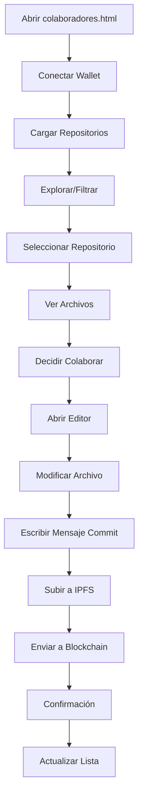

# 🤝 Sistema de Colaboración BlockHub

## 📋 Descripción General

El sistema de colaboración de BlockHub permite que múltiples desarrolladores trabajen juntos en repositorios de código almacenados en blockchain e IPFS. Los colaboradores pueden visualizar todos los repositorios existentes, acceder a los archivos, realizar modificaciones y enviar commits que quedan registrados permanentemente en la blockchain.

## 🚀 Funcionalidades Principales

### 1. **Visualización de Repositorios** 📁
- **Función**: `getAllRepos()` (sin parámetros)
- **Retorna**: Array con todos los repositorios públicos
- **Datos incluidos**:
  - `tokenId`: ID único del NFT del repositorio
  - `name`: Nombre del repositorio
  - `owner`: Dirección del propietario
  - `cid`: Hash IPFS del repositorio

### 2. **Sistema de Commits** 🔄
- **Función**: `processNewCommit(tokenId, mensaje, nuevoCID)`
- **Parámetros**:
  - `tokenId`: ID del repositorio a modificar
  - `mensaje`: Descripción de los cambios
  - `nuevoCID`: Hash IPFS del archivo modificado
- **Resultado**: Commit registrado en blockchain

## 🎯 Páginas y Componentes

### **colaboradores.html** - Página Principal de Colaboración

#### Características:
- **📊 Dashboard de Estadísticas**
  - Total de repositorios
  - Propietarios únicos
  - Mis repositorios

- **🔍 Sistema de Búsqueda y Filtrado**
  - Búsqueda por nombre o dirección
  - Filtros: Todos, Míos, Otros, Recientes
  - Búsqueda en tiempo real

- **📋 Visualización de Repositorios**
  - Grid responsivo de tarjetas
  - Información completa de cada repo
  - Acciones disponibles por repositorio

#### Acciones Disponibles:
1. **👁️ Ver Archivos**: Visualiza el contenido del repositorio
2. **🤝 Colaborar**: Abre el editor para realizar cambios
3. **📋 Copiar CID**: Copia el hash IPFS al portapapeles

## 🛠️ Flujo de Colaboración

### Paso 1: Explorar Repositorios
```javascript
// Obtener todos los repositorios
const repos = await getAllRepositories();

// Ver estadísticas
const stats = await getRepositoryStats();
```

### Paso 2: Seleccionar Repositorio
- Navega por la lista de repositorios
- Usa filtros para encontrar proyectos de interés
- Revisa información del propietario y contenido

### Paso 3: Ver Archivos
- Haz clic en "👁️ Ver Archivos"
- Explora el contenido actual
- Identifica archivos a modificar

### Paso 4: Colaborar
- Haz clic en "🤝 Colaborar"
- Selecciona el archivo a editar
- Realiza modificaciones en el editor
- Agrega mensaje descriptivo del commit

### Paso 5: Enviar Commit
```javascript
// Proceso automático al hacer submit:
// 1. Subir archivo modificado a IPFS
// 2. Obtener nuevo CID
// 3. Llamar processNewCommit en blockchain
const result = await processNewCommit(tokenId, "Mensaje del commit", nuevoCID);
```

## 🔧 Integración Técnica

### Funciones Web3 Principales

#### `getAllRepositories()`
```javascript
// Usando la integración Web3
const web3Service = new Web3ContractService();
await web3Service.initializeWeb3();
const result = await web3Service.getAllRepositories();

// Usando estilo Remix
await initializeRemixStyle();
const repos = await getAllRepositories();
```

#### `processNewCommit(tokenId, message, commitCID)`
```javascript
// Enviar commit con Web3Service
const commitResult = await web3Service.processNewCommit(
    tokenId, 
    "Fix: corrección de bug en función main", 
    "QmNewCID123..."
);

// Enviar commit estilo Remix
const result = await processNewCommit(
    "1", 
    "Add: nueva funcionalidad de validación", 
    "QmAnotherCID456..."
);
```

### Eventos de Blockchain

#### `processedCommit`
```json
{
    "tokenId": "1",
    "owner": "0x123...",
    "committer": "0x456...",
    "repoCID": "QmNewCID..."
}
```

## 📱 Interfaz de Usuario

### Diseño Responsivo
- **Desktop**: Grid de 3-4 columnas
- **Tablet**: Grid de 2 columnas  
- **Mobile**: Lista vertical

### Estados de la Aplicación
- **🔄 Loading**: Cargando repositorios desde blockchain
- **❌ Error**: Manejo de errores con opción de reintentar
- **📭 Empty**: Sin repositorios encontrados
- **✅ Success**: Repositorios cargados correctamente

### Componentes Interactivos
- **Modal de Archivos**: Visualización de contenido
- **Editor de Colaboración**: Modificación y commit
- **Barra de Estado**: Información de conexión wallet

## 🔐 Seguridad y Permisos

### Control de Acceso
- **Visualización**: Todos pueden ver repositorios públicos
- **Colaboración**: Requiere wallet conectado
- **Commits**: Firmados por el colaborador
- **Historial**: Inmutable en blockchain

### Validaciones
- Verificación de conexión MetaMask
- Validación de datos antes de envío
- Confirmación de transacciones
- Manejo de errores de red

## 📊 Monitoreo y Analytics

### Métricas Disponibles
```javascript
const stats = await getRepositoryStats();
// {
//     totalRepositories: 25,
//     myRepositories: 3,
//     uniqueOwners: 12,
//     repositories: [...]
// }
```

### Información de Commits
- Hash de transacción
- Bloque de confirmación
- Gas utilizado
- Timestamp del commit
- Dirección del colaborador

## 🎨 Guías de UI/UX

### Paleta de Colores
- **Principal**: `#00ff00` (Verde matrix)
- **Fondo**: `#000000` (Negro)
- **Secundario**: `#333333` (Gris oscuro)
- **Error**: `#ff4444` (Rojo)
- **Éxito**: `#00aa00` (Verde oscuro)

### Tipografía
- **Principal**: `'Courier New', monospace`
- **Efectos**: Text-shadow para brillo matrix
- **Tamaños**: Escalables y responsivos

### Animaciones
- Hover effects en tarjetas
- Loading spinners
- Transiciones suaves
- Matrix-style effects

## 🚦 Casos de Uso

### 1. **Desarrollador Independiente**
- Explora proyectos open source
- Contribuye con fixes y mejoras
- Construye reputación en blockchain

### 2. **Equipo de Desarrollo**
- Colabora en proyectos compartidos
- Trackea contribuciones individuales
- Mantiene historial inmutable

### 3. **Revisor de Código**
- Examina commits pendientes
- Aprueba o rechaza cambios
- Asigna recompensas

## 🔄 Flujo Completo de Colaboración



## 📚 Comandos de Desarrollo

### Testing en Consola
```javascript
// Inicializar
await initializeRemixStyle();

// Ver todos los repos
const repos = await getAllRepositories();

// Stats rápidas
const stats = await getRepositoryStats();

// Hacer commit
const result = await processNewCommit("1", "Test commit", "QmTestCID");
```

### Debugging
```javascript
// Verificar conexión
checkConnection();

// Info de cuenta
const account = await getAccountInfo();

// Contratos disponibles
console.log(window.factoryContract);
console.log(window.poapContract);
```

## 🎯 Próximas Funcionalidades

### En Desarrollo
- [ ] Sistema de aprobación de commits
- [ ] Recompensas automáticas
- [ ] Métricas de contribución
- [ ] POAPs por logros

### Planeadas
- [ ] Chat entre colaboradores
- [ ] Code review integrado
- [ ] Notificaciones push
- [ ] Dashboard de analytics

## 🆘 Troubleshooting

### Problemas Comunes

**1. No se cargan repositorios**
- Verificar conexión MetaMask
- Comprobar red correcta
- Revisar contratos desplegados

**2. Error en commits**
- Verificar saldo de gas
- Comprobar permisos de archivo
- Validar formato de CID

**3. Problemas de UI**
- Refrescar página
- Limpiar caché del navegador
- Verificar JavaScript habilitado

### Logs de Debug
```javascript
// Habilitar logs detallados
localStorage.setItem('debug', 'true');

// Ver logs en consola
console.log('🔍 Debugging habilitado');
```

---

## 🎉 ¡Listo para Colaborar!

El sistema de colaboración BlockHub está completamente funcional y listo para uso. Los colaboradores pueden ahora:

✅ **Explorar** todos los repositorios disponibles  
✅ **Visualizar** archivos y contenido  
✅ **Colaborar** realizando modificaciones  
✅ **Commitear** cambios a blockchain  
✅ **Trackear** su historial de contribuciones  

**¡Empieza a colaborar ahora abriendo `colaboradores.html`!** 🚀
